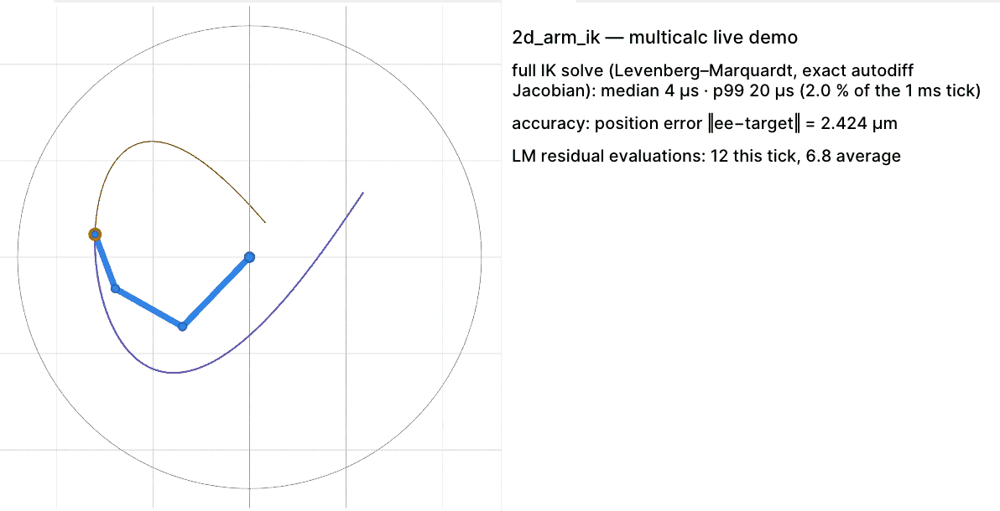
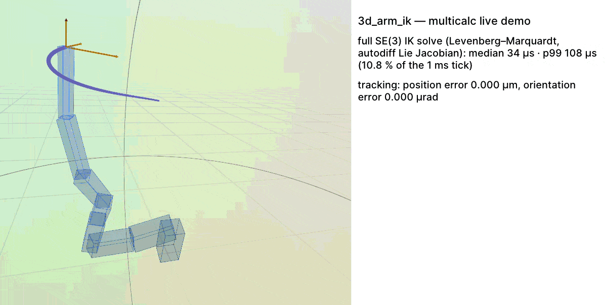

# multicalc-demos

Runnable demos for [`multicalc`](../crates/multicalc), in two flavors:

- **Basics** — headless, terminating programs, one per module. Each prints its results against
  the known analytic value (with the `|err|`) and self-checks with an assert. No viewer, no
  feature flags; they depend only on `multicalc`.
- **Showcases** — live [Rerun](https://rerun.io) demos that render an animated scene and stream
  live-measured speed and accuracy. They require the `rerun` feature (on by default) and a
  version-matched viewer.

This is a satellite crate: it is never a dependency of the core library, is excluded from
bare-metal builds and the default `cargo test`, and its dependency tree is excluded from the
workspace supply-chain audit.

## Start here

No viewer, no flags — each terminates and prints results vs the analytic value with the `|err|`:

```sh
cargo run -p multicalc-demos --example <name>
```

| Example | Module(s) | What it shows |
| --- | --- | --- |
| `approximation` | `approximation` | Linear and quadratic (Taylor) approximations, `predict`, and goodness-of-fit metrics. |
| `autodiff_scalars` | `scalar` | Use `Dual` and `HyperDual` directly: evaluate a generic `Numeric` function and read f, f′, f″ from the result fields (no derivator). |
| `curve_fit` | `optimization` | Levenberg-Marquardt fit of `y = a·e^(b·t)` to sensor samples with exact autodiff Jacobians; prints recovered `a`, `b`, and `\|err\|`. |
| `differentiation` | `numerical_derivative` | Single- and multi-variable derivatives (orders 1-3, partials, mixed partials) by autodiff. |
| `discretization` | `discretization`, `linear_algebra::expm` | ZOH on a double integrator, Van Loan process-noise discretization, the filterpy `q_discrete_white_noise` model, and a one-`Dual` derivative through the matrix exponential. |
| `gaussian_integration` | `numerical_integration::gaussian_integration` | Gauss-Legendre (finite), Gauss-Hermite and Gauss-Laguerre (infinite), with the bare-integrand convention. |
| `iterative_integration` | `numerical_integration::iterative_integration` | Boole / Simpson / Trapezoidal rules, multi-variable partial integrals, and infinite / semi-infinite limits. |
| `jacobian_hessian` | `numerical_derivative::{jacobian, hessian}` | Jacobian of a vector of functions and the Hessian of a scalar function. |
| `kinematics` | `kinematics` | Wheel↔body maps and their round trip, exact SE(2) odometry against the closed-form arc, a figure eight through the encoder path, and a one-`Dual` derivative pushed through an odometry step. |
| `lie_groups` | `spatial` | SO(3)/SE(3) compose, act on a point, exp/log round trips, geodesic interpolation, and a one-`Dual` autodiff derivative pushed through `exp` ∘ `act`. |
| `linear_algebra` | `linear_algebra` | LU and Cholesky factorizations, linear solves, and the direct 4x4 inverse under a latency + approximation-error stress test on well- and ill-conditioned inputs. |
| `ode` | `ode` | Fixed-step RK4 and adaptive RK45 on the harmonic oscillator (known solution) plus an acrobot, a tumbling quadrotor, and an outer-solar-system N-body, reporting error and conserved-quantity drift. |
| `optimization_solvers` | `optimization` | Gauss-Newton on a well-conditioned linear residual (`y = a + b·t`); when GN is enough vs LM (`curve_fit`). |
| `root_finding` | `root_finding` | Bracketed bisection, Newton with exact derivatives, damped (backtracking) Newton rescuing a far start, and a square-system Newton solve, each printed against its known root. |
| `svd` | `linear_algebra::svd` | Singular value decomposition and Moore-Penrose pseudo-inverse under a robotics stress test (Kabsch rotation recovery, a redundant-arm pseudo-inverse, a near-singular Jacobian, and an overdetermined fit) with latency + approximation error. |
| `vector_field` | `vector_field` | Curl, divergence, line integrals and flux integrals. |

`linear_algebra` and `svd` also print per-call latency; build them `--release` for representative
numbers.

## Live showcases

Five live demos spanning the core modules, each an attention-grabbing animated scene that markets
the library's raw speed and accuracy. They need the `rerun` feature (on by default) and a
version-matched viewer already up. **Every number on screen is measured live** with
`std::time::Instant` inside the demo — nothing is hardcoded. Run each with `--release` (mandatory
for the timing readouts):

```sh
cargo run --release -p multicalc-demos --example <name>
```

Each demo advances its simulation on logical time (a fixed 1 ms per tick / one step per frame),
so the numbers are deterministic and reproducible. An OS scheduling spike can make a tick display
late or jitter but never changes what the demo computes.

The figures below are representative of a modern desktop core (`x86_64`, `--release`).

- **`2d_arm_ik`** (optimization) — a 3-link arm runs a complete Levenberg-Marquardt IK solve, with
  exact autodiff Jacobians, every single millisecond. **Median solve ≈ 6 µs — under 1 % of the
  1 ms budget — with zero missed ticks over 120,000 solves.**

  

- **`3d_arm_ik`** (spatial) — an 8-link SE(3) arm chases a moving 3D target in position and
  orientation. Every millisecond a full Levenberg-Marquardt solve runs whose Jacobian — exp, log,
  and compose through the whole Lie chain — comes from a single autodiff pass, with no hand-derived
  kinematics. **Median solve ≈ 30 µs, tracking the moving target pose to a sub-micron position.**

    

- **`newton_fractal`** (root finding) — every pixel is a full Newton-system solve with an exact
  autodiff Jacobian, and the cubic's basins swirl as its roots orbit. **≈ 4 million Newton
  solves/sec on one core** (a 256×256 grid re-solved at ~60 fps), each converged root accurate to
  **≈ 5e-15**.

  

- **`fourier_ferris`** (integration) — Gauss-Legendre quadrature computes the Fourier coefficients
  of Ferris's outline; a chain of epicycles then draws the crab. **≈ 600,000 quadrature node
  evaluations in ≈ 8 ms** at startup, with every coefficient matching the exact closed form to
  **≈ 1e-15**.

  

- **`gradient_marbles`** (autodiff) — 2,000 marbles across a 3D Himmelblau landscape, each steered
  by an exact autodiff gradient every millisecond. **2,000 exact gradients in under 3 µs per tick
  (~750,000 gradients/ms), and the autodiff-vs-analytic error is pinned at exactly 0.0** on screen.

  

`curve_fit_live` and `curve_fit_record` are two more showcase examples: the first streams a live
Levenberg-Marquardt fit, the second writes a `.rrd` (and a `.csv`) with no viewer needed.

## Viewer setup

### Versions

Rerun SDK `=0.33.1` ⇄ viewer `0.33.1`. The SDK is exact-pinned; the viewer must match.

### Install (for the live showcases)

`live()` spawns the external Rerun viewer found on PATH, so install it version-matched to the SDK:

```
cargo install rerun-cli --locked --version 0.33.1
# or: pip install rerun-sdk==0.33.1
# or: cargo binstall rerun-cli --version 0.33.1
```

### Recorded output and the CSV fallback

`curve_fit_record` needs no viewer; it writes a `.rrd` and a `.csv` to the temp dir:

```
cargo run -p multicalc-demos --example curve_fit_record
```

Open the printed `.rrd` in the viewer, or render the CSV fallback:

```
python demos/plot.py <printed-csv-path> --x t
```

### WSL usage (viewer on Windows)

The live viewer is a GPU application; under WSL its virtualized GPU often cannot start it. Run
the viewer on Windows instead (real GPU) and stream to it from WSL over gRPC.

1. Enable mirrored networking so WSL and Windows share `localhost`. In `C:\Users\<you>\.wslconfig`:

   ```ini
   [wsl2]
   networkingMode=mirrored
   ```

   Then from Windows PowerShell run `wsl --shutdown`, reopen WSL, and confirm:

   ```
   wslinfo --networking-mode      # -> mirrored
   ```

2. Install the viewer on Windows if needed, version-matched to the SDK (0.33.1):

   ```
   pip install rerun-sdk==0.33.1      # provides the `rerun` command
   # or download the prebuilt rerun.exe for 0.33.1
   ```

3. Start the viewer on Windows (it listens on port 9876):

   ```
   rerun
   ```

4. From WSL, run a live example. Under WSL it auto-detects the environment and streams to the
   Windows viewer over the shared localhost instead of spawning a local one:

   ```
   cargo run -p multicalc-demos --example curve_fit_live
   ```

   The Windows viewer from step 3 MUST already be running — under WSL the example connects to it
   and does not spawn one.

On NAT networking (the WSL default) instead of mirrored, set `RERUN_VIZ_URL` to the Windows host,
launch the viewer bound to `0.0.0.0`, and allow inbound TCP 9876 in Windows Firewall:

```
export RERUN_VIZ_URL="rerun+http://$(ip route show default | awk '{print $3}'):9876/proxy"
cargo run -p multicalc-demos --example curve_fit_live
```
