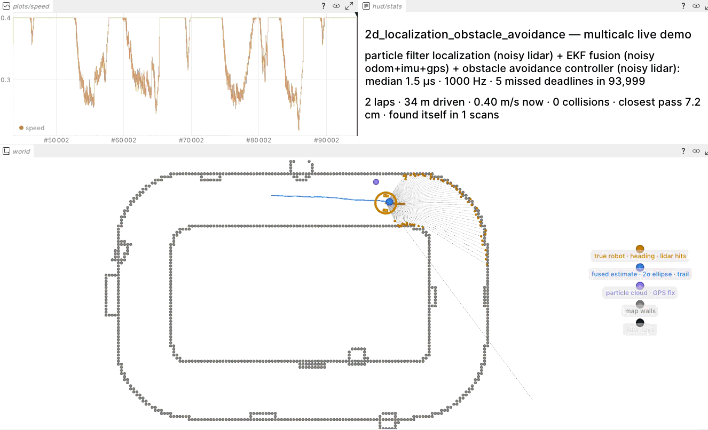
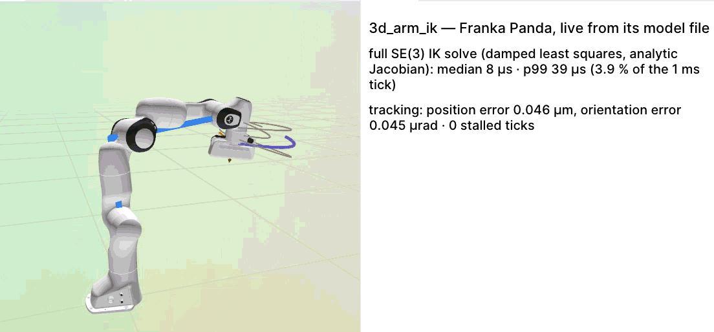
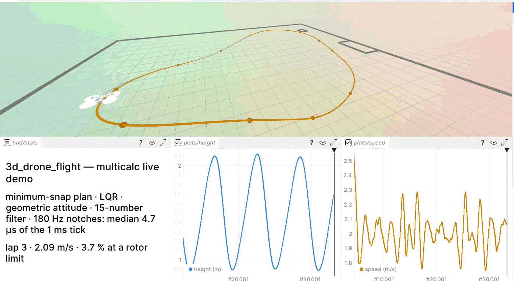
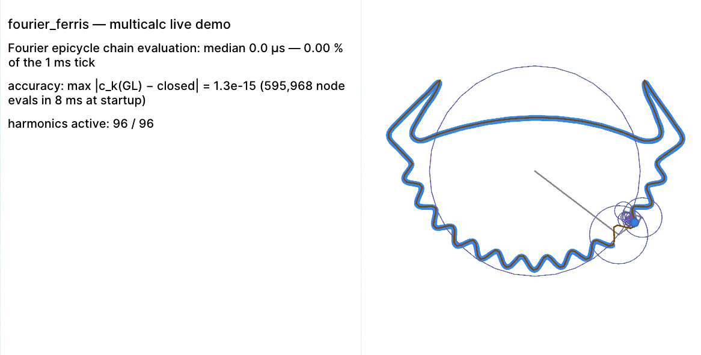

# multicalc-demos

Runnable demos for [`multicalc`](../crates/multicalc), in two flavors:

- **Basics**: headless, terminating programs, one per module. Each prints its results against
  the known analytic value (with the `|err|`) and self-checks with an assert. No viewer, and no
  feature flags bar `localized_lap_check`. They depend only on `multicalc`, except
  `mjcf_model_ingestion` and `urdf_model_ingestion`, which read model files through
  `multicalc-robot-model`.
- **Showcases**: live [Rerun](https://rerun.io) demos that render an animated scene and stream
  live-measured speed and accuracy. They require the `rerun` feature (on by default) and a
  version-matched viewer.

This is a satellite crate: it is never a dependency of the core library, is excluded from
bare-metal builds and the default `cargo test`, and its dependency tree is excluded from the
workspace supply-chain audit.

## Start here

No viewer, no flags. Each terminates and prints results vs the analytic value with the `|err|`:

```sh
cargo run -p multicalc-demos --example <name>
```

| Example | Module(s) | What it shows |
| --- | --- | --- |
| `approximation` | `approximation` | Linear and quadratic (Taylor) approximations, `predict`, and goodness-of-fit metrics. |
| `attitude_filter` | `estimation`, `ode::ExponentialMap` | `MahonyFilter` and `MadgwickFilter` on identical readings: a starting facing taken off a still body from which way is down and which way is north, then a tumble on a turn-rate sensor carrying an offset neither filter was told about, with both recovering the facing and the offset. |
| `autodiff_scalars` | `scalar` | Use `Dual` and `HyperDual` directly: evaluate a generic `Numeric` function and read f, f′, f″ from the result fields (no derivator). |
| `avoidance` | `control::follow_the_gap`, `ode` | Follow-the-Gap steering a simulated lidar scan through a corridor with a pillar: gap selection, RK4-integrated commands, and the walled-in full-stop case. |
| `control_loops` | `control`, `motion`, `discretization` | Four feedback loops: `Pid` on a motor, `Lqr` on a cart carrying a pole, `GeometricAttitudeController` on a tumbling body, and all of it together flying a set of waypoints and coming home. |
| `curve_fit` | `optimization` | Levenberg-Marquardt fit of `y = a·e^(b·t)` to sensor samples with exact autodiff Jacobians; prints recovered `a`, `b`, and `\|err\|`. |
| `differentiation` | `numerical_derivative` | Single- and multi-variable derivatives (orders 1-3, partials, mixed partials) by autodiff. |
| `discretization` | `discretization`, `linear_algebra::expm` | ZOH on a double integrator, Van Loan process-noise discretization, the filterpy `q_discrete_white_noise` model, and a one-`Dual` derivative through the matrix exponential. |
| `error_state_estimation` | `estimation` | `ErrorStateKalmanFilter` driven by an IMU: a starting facing off a still body, a short tumble on turn-rate readings alone, then a room tracker and a heading aid folded in, with the injected sensor offsets converging on their true values. |
| `estimation` | `estimation`, `discretization::q_discrete_white_noise` | A linear Kalman filter tracking a constant-velocity target: an exact two-step hand check, velocity recovered from position-only measurements, Joseph vs naive covariance, a control input, innovation gating of an outlier, and a one-`Dual` derivative through an update that reproduces the Kalman gain. |
| `forward_kinematics` | `kinematics` | A robot held as a `KinematicTree`: a planar two-link arm against its closed form, a joint whose reference configuration is shifted away from the model's zero, a branch carrying two links side by side, and a one-`Dual` derivative pushed straight through the whole solve. |
| `gaussian_integration` | `numerical_integration::gaussian_integration` | Gauss-Legendre (finite), Gauss-Hermite and Gauss-Laguerre (infinite), with the bare-integrand convention. |
| `iterative_integration` | `numerical_integration::iterative_integration` | Boole / Simpson / Trapezoidal rules, multi-variable partial integrals, and infinite / semi-infinite limits. |
| `jacobian_hessian` | `numerical_derivative::{jacobian, hessian}` | Jacobian of a vector of functions and the Hessian of a scalar function. |
| `kinematics` | `kinematics` | Wheel↔body maps and their round trip, exact SE(2) odometry against the closed-form arc, a figure eight through the encoder path, and a one-`Dual` derivative pushed through an odometry step. |
| `lie_groups` | `spatial` | SO(3)/SE(3) compose, act on a point, exp/log round trips, geodesic interpolation, and a one-`Dual` autodiff derivative pushed through `exp` ∘ `act`. |
| `linear_algebra` | `linear_algebra` | LU and Cholesky factorizations, linear solves, and the direct 4x4 inverse under a latency + approximation-error stress test on well- and ill-conditioned inputs. |
| `localized_lap_check` | `estimation`, `control`, `kinematics` | The headless acceptance gate for the `2d_localization_obstacle_avoidance` showcase: drives 600,000 seeded ticks and asserts zero contacts, a fused position RMS under 5 cm, fusion beating dead reckoning threefold, and the per-tick cost. Needs `--features alloc`. |
| `minimum_snap_trajectory` | `motion` | `MinimumSnapPlanner` planning a trajectory off the loop, then evaluating it inside one. |
| `mjcf_model_ingestion` | `spatial`, `multicalc-robot-model` | Loads a MuJoCo model file and reports a free body's mass, balance point and resistance to spinning, then a jointed robot's body tree, joint travel and joint settings. |
| `ode` | `ode` | Fixed-step RK4 and adaptive RK45 on the harmonic oscillator (known solution) plus an acrobot, a tumbling quadrotor, and an outer-solar-system N-body, reporting error and conserved-quantity drift. |
| `optimization_solvers` | `optimization` | Gauss-Newton on a well-conditioned linear residual (`y = a + b·t`); when GN is enough vs LM (`curve_fit`). |
| `polynomials` | `polynomial` | Evaluating a polynomial with its derivatives in one pass, finding its real roots, building one from data, and several variables with symbolic partials. |
| `rigid_body_dynamics` | `dynamics`, `plant` | A body tumbling with nothing acting on it and a body dropped from rest, both checked against what is conserved; then four rotors holding a hover, the moment they take to catch up to what they are asked for, a roll command split across them, and a command bigger than the rotors have. |
| `root_finding` | `root_finding` | Bracketed bisection, Newton with exact derivatives, damped (backtracking) Newton rescuing a far start, and a square-system Newton solve, each printed against its known root. |
| `signal_filters` | `signal_processing`, `random` | A notch removing a single tone and a low-pass letting the slow part through, plus `RunningMedian` and `SavitzkyGolay` smoothing on a seeded noisy signal. |
| `svd` | `linear_algebra::svd` | Singular value decomposition and Moore-Penrose pseudo-inverse under a robotics stress test (Kabsch rotation recovery, a redundant-arm pseudo-inverse, a near-singular Jacobian, and an overdetermined fit) with latency + approximation error. |
| `urdf_model_ingestion` | `spatial`, `multicalc-robot-model` | Loads a URDF model file and reports the robot's body tree, which links carry mass and which are bare frames, each joint's axis and travel, and the coupled gripper joint that keeps the whole model from becoming one tree. |
| `vector_field` | `vector_field` | Curl, divergence, line integrals and flux integrals. |

`linear_algebra` and `svd` also print per-call latency; build them `--release` for representative
numbers. `localized_lap_check` is the one basics example that needs a feature flag
(`--features alloc`, for the particle filter) and should also be built `--release`.

## Live showcases

Six live demos spanning the core modules, each an attention-grabbing animated scene that markets
the library's raw speed and accuracy. They need the `rerun` feature (on by default) and a
version-matched viewer already up. **Every number on screen is measured live** with
`std::time::Instant` inside the demo, so nothing is hardcoded. Run each with `--release` (mandatory
for the timing readouts):

```sh
cargo run --release -p multicalc-demos --example <name>
```

Each demo advances its simulation on logical time (a fixed 1 ms per tick / one step per frame),
so the numbers are deterministic and reproducible. An OS scheduling spike can make a tick display
late or jitter but never changes what the demo computes.

The figures below are representative of a modern desktop core (`x86_64`, `--release`).

- **`2d_localization_obstacle_avoidance`** (estimation + control). A
  differential-drive robot boots not knowing where it is; a 2,000-particle filter matches its noisy
  lidar to a known map to find itself, then a 5-state EKF fuses noisy wheel odometry, an IMU, and
  GPS to hold a centimetre-level global pose while a Follow-the-Gap controller laps a course of
  obstacles on the noisy lidar alone. **Localize, fuse, and plan every millisecond in a
  median 0.72 µs of the 1 ms tick, with zero collisions over 600,000 ticks.**

  

- **`3d_arm_ik`** (spatial, kinematics). A Franka Panda, read from its MuJoCo model file,
  chases a moving 3D target in position and orientation. Every millisecond a damped-least-squares
  solve runs against the arm's analytic geometric Jacobian, holding every joint inside the travel
  the model states and spending the freedom the task leaves over on a comfortable posture.
  **The panel shows the live solve cost against the 1 ms budget.**

    

- **`3d_drone_flight`** (dynamics + control + estimation). A Skydio X2, its mass read out of its own
  MuJoCo model file, is set down on a pad knowing roughly where it is and nothing about which way it
  faces. It hovers and turns on the spot while 600 guesses are scored against a floor plan of the
  room, then climbs onto a minimum-snap line through ten corners and flies it for ever — on a shaken
  IMU cleaned up by notches that follow the rotors' own rate, a 15-state error-state filter, an LQR
  position loop and a geometric attitude loop, with nothing that decides anything allowed to see the
  truth. The machine is drawn at its own estimate and the trail behind it is true positions, so the
  gap between the two is the estimate's error at life size. **The whole stack runs in a median
  ≈ 2 µs of the 1 ms tick**.

  

- **`newton_fractal`** (root finding). Every pixel is a full Newton-system solve with an exact
  autodiff Jacobian, and the cubic's basins swirl as its roots orbit. **≈ 4 million Newton
  solves/sec on one core** (a 256×256 grid re-solved at ~60 fps), each converged root accurate to
  **≈ 5e-15**.

  

- **`fourier_ferris`** (integration). Gauss-Legendre quadrature computes the Fourier coefficients
  of Ferris's outline; a chain of epicycles then draws the crab. **≈ 600,000 quadrature node
  evaluations in ≈ 8 ms** at startup, with every coefficient matching the exact closed form to
  **≈ 1e-15**.

  

- **`gradient_marbles`** (autodiff). 2,000 marbles across a 3D Himmelblau landscape, each steered
  by an exact autodiff gradient every millisecond. **2,000 exact gradients in under 3 µs per tick
  (~750,000 gradients/ms), and the autodiff-vs-analytic error is pinned at exactly 0.0** on screen.

  

`curve_fit_live` is one more showcase example: a live Levenberg-Marquardt fit, streamed as it
converges.

## Viewer setup

### Versions

Rerun SDK `=0.33.1` ⇄ viewer `0.33.1`. The SDK is exact-pinned; the viewer must match.

### Install (for the live showcases)

`live()` spawns the external Rerun viewer found on PATH, so install it version-matched to the SDK:

```
cargo install rerun-cli --locked --version 0.33.1
# or: pip install rerun-sdk==0.33.1
# or: cargo binstall rerun-cli --version 0.33.1
```

### WSL usage (viewer on Windows)

The live viewer is a GPU application; under WSL its virtualized GPU often cannot start it. Run
the viewer on Windows instead (real GPU) and stream to it from WSL over gRPC.

1. Enable mirrored networking so WSL and Windows share `localhost`. In `C:\Users\<you>\.wslconfig`:

   ```ini
   [wsl2]
   networkingMode=mirrored
   ```

   Then from Windows PowerShell run `wsl --shutdown`, reopen WSL, and confirm:

   ```
   wslinfo --networking-mode      # -> mirrored
   ```

2. Install the viewer on Windows if needed, version-matched to the SDK (0.33.1):

   ```
   pip install rerun-sdk==0.33.1      # provides the `rerun` command
   # or download the prebuilt rerun.exe for 0.33.1
   ```

3. Start the viewer on Windows (it listens on port 9876):

   ```
   rerun
   ```

4. From WSL, run a live example. Under WSL it auto-detects the environment and streams to the
   Windows viewer over the shared localhost instead of spawning a local one:

   ```
   cargo run -p multicalc-demos --example curve_fit_live
   ```

   The Windows viewer from step 3 MUST already be running; under WSL the example connects to it
   and does not spawn one.

On NAT networking (the WSL default) instead of mirrored, set `RERUN_VIZ_URL` to the Windows host,
launch the viewer bound to `0.0.0.0`, and allow inbound TCP 9876 in Windows Firewall:

```
export RERUN_VIZ_URL="rerun+http://$(ip route show default | awk '{print $3}'):9876/proxy"
cargo run -p multicalc-demos --example curve_fit_live
```
